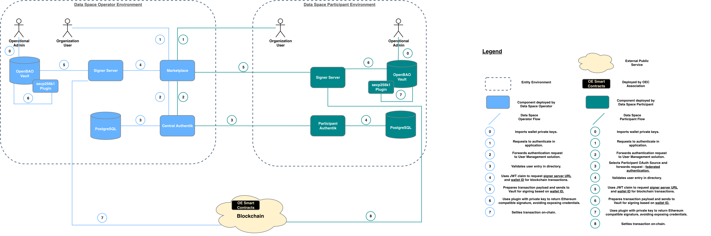

# Signer Server

Remote Web3 signing service for Ocean Enterprise.

Signer Server provides an authenticated service boundary between Ocean Enterprise applications and blockchain signing keys. Instead of requiring applications to handle private keys directly, clients request signing operations from Signer Server. The service resolves the appropriate signer, performs the cryptographic operation, and returns or broadcasts the resulting signed payload.

The project is implemented in TypeScript with [NestJS](https://nestjs.com/) and is designed for containerized deployment.

> **Security-sensitive component:** Signer Server handles blockchain signing operations and may have access to private-key material depending on the configured key-storage mode. Review the deployment and security documentation before using it in a production environment.

---

## Table of Contents

- [Purpose](#purpose)
- [Motivation](#motivation)
- [Objectives](#objectives)
- [Scope](#scope)
- [Features](#features)
- [Architecture](#architecture)
- [Signing and Key Management](#signing-and-key-management)
- [Authentication and Authorization](#authentication-and-authorization)
- [Supported Operations](#supported-operations)
- [Quick Start for Development](#quick-start-for-development)
- [Deployment](#deployment)
- [Configuration](#configuration)
- [API Documentation](#api-documentation)
- [Development](#development)
- [Testing and Quality](#testing-and-quality)
- [Security](#security)
- [Contributing](#contributing)
- [Governance and Support](#governance-and-support)
- [Project Status](#project-status)

---

## Purpose

Ocean Enterprise components need to perform blockchain operations such as signing messages and submitting transactions. Directly embedding private keys in every application increases operational complexity and expands the number of places where sensitive key material must be handled.

Signer Server provides a Web3 signer abstraction.

Applications interact with a service API instead of implementing key handling and signing logic themselves. This separates application functionality from key storage and provides a common integration point for authentication, chain configuration, signing, and transaction submission.

At a high level:


Signer Server is intended to act as a dedicated signing component in the Ocean Enterprise software stack.

---

## Motivation

A shared signer service addresses several problems that otherwise have to be solved independently by each application:

- applications do not need to implement their own blockchain signing layer;
- signing behavior can be exposed through one consistent API;
- blockchain RPC endpoints can be configured centrally;
- authentication can be enforced before a signing operation is accepted;
- private-key handling can be isolated from application business logic;
- key-storage mechanisms can evolve without changing every application that consumes signing functionality;
- signing operations can be deployed and operated as a separate security boundary.

The abstraction is especially useful where multiple Ocean Enterprise services need blockchain identities but should not all manage private keys independently.

---

## Objectives

Signer Server aims to provide:

1. **A consistent signing API** for Ocean Enterprise services.
2. **Remote message signing** for blockchain identities.
3. **Transaction signing and broadcasting** through configured RPC endpoints.
4. **Authenticated access** using Authentik-issued JWTs.
5. **Multi-chain configuration** without embedding RPC details in consuming applications.
6. **Pluggable key handling**, allowing deployments to separate development-oriented local key configuration from external secure key storage.
7. **Container-based deployment** suitable for integration into the Ocean Enterprise stack.
8. **Testable and maintainable implementation** with linting, type checking, automated tests, and security scanning.

---

## Directory Structure

The application follows a modular NestJS architecture.

```text
src/
├── auth/
│   ├── strategies/
│   └── auth.module.ts
│
├── common/
│   ├── decorators/
│   ├── filters/
│   ├── guards/
│   └── interceptors/
│
├── config/
│   ├── configuration.ts
│   └── validation.ts
│
├── signer/
│   ├── dto/
│   ├── interfaces/
│   ├── signer.controller.ts
│   ├── signer.service.ts
│   └── signer.module.ts
│
├── app.module.ts
└── main.ts

test/
└── e2e/
```

---

## Signing and Key Management

Signer Server separates the API used by applications from the mechanism used to provide signing keys.

The deployment documentation in [`/docs`](./docs/) is the authoritative source for configuring the supported deployment and key-storage modes.

A deployment may use different key-management approaches depending on its environment. Development-oriented configurations should be treated differently from production key storage.

### Security Principle

Calling applications should interact with Signer Server by signer or wallet identity and should not need access to the underlying private key.

---

## Authentication and Authorization

Protected API endpoints use Authentik JWT authentication.

The authentication layer validates the token configuration, including:

- JWT signature;
- JWKS endpoint;
- issuer;
- audience;
- configured upstream identity provider.

The current configuration uses the following Authentik-related environment variables:

```text
AUTHENTIK_JWKS_URI
AUTHENTIK_ISSUER
AUTHENTIK_AUDIENCE
UPSTREAM_IDP
```

Protected requests use:

```http
Authorization: Bearer <jwt>
```

Public endpoints can be explicitly marked as public by the application.

The health endpoint is public.

### Origin restrictions

`ALLOWED_ORIGINS` can be configured to restrict protected requests to expected application origins.

When origin restrictions are enabled, configure only trusted Ocean Enterprise application origins.

---

## Supported Operations

The service currently exposes operations under `/api/v1`.

| Method | Endpoint                    | Purpose                                                      |
| ------ | --------------------------- | ------------------------------------------------------------ |
| `GET`  | `/api/v1/address`           | Return the configured signer address                         |
| `GET`  | `/api/v1/nonce`             | Return nonce information required for transaction operations |
| `GET`  | `/api/v1/transaction/:hash` | Retrieve transaction information                             |
| `POST` | `/api/v1/sign-message`      | Sign a message                                               |
| `POST` | `/api/v1/send-transaction`  | Sign and submit a transaction                                |
| `GET`  | `/api/v1/health`            | Service health check                                         |

For request and response schemas, use the running Swagger/OpenAPI documentation.

---

## Quick Start for Development

> This section is for local development. For an operational deployment, use the documentation in [`/docs`](./docs/).

### Prerequisites

- Node.js version compatible with the repository
- npm
- access to the required blockchain RPC endpoint(s)
- an Authentik configuration for authenticated API testing

Install dependencies:

```bash
npm install
```

Create a local environment file:

```bash
cp .env.example .env
```

Configure the required development values in `.env`.

Run in watch mode:

```bash
npm run start:dev
```

The default API base URL is:

```text
http://localhost:3001/api/v1
```

Swagger is available at:

```text
http://localhost:3001/api
```

---

## Deployment

Production and Docker-based deployment procedures are intentionally maintained outside the root README.

See:

### Signer Server deployment documentation

For signer server deployment, these are available procedures:

- [Signer server mode `vault`](./docs/vault-signer-server-deployment.md) which describes docker compose deployment instructions from [here](./docker-compose/vault/)
- [Signer server mode `local`](./docs/local-signer-server-deployment.md) which describes docker compose deployment instructions from [here](./docker-compose/local/)

### Development-only Docker usage

For basic local container testing, the repository also provides Docker support.

Build:

```bash
docker build -t signer-server .
```

Run:

```bash
docker run \
  --env-file .env \
  -p 8443:3001 \
  signer-server
```

For the complete supported Compose deployment, follow [`/docs`](./docs/) rather than relying on the development example above.

---

## Configuration

Configuration is supplied through environment variables.

Start from:

```bash
cp .env.example .env
```

The main configuration groups are shown below.

### Blockchain configuration

`NODE_URI_MAP` maps supported chain IDs to RPC endpoints and optional transaction configuration.

Example structure:

```json
[
  {
    "11155111": {
      "key": "https://<ethereum-sepolia-rpc>",
      "multiplier": 3
    }
  }
]
```

Do not commit provider API keys.

### Authentication configuration

```text
AUTHENTIK_JWKS_URI
AUTHENTIK_ISSUER
AUTHENTIK_AUDIENCE
UPSTREAM_IDP
```

### Application configuration

```text
PORT
NODE_ENV
ALLOWED_ORIGINS
SIGNER_SERVER_PORT
```

---

## API Documentation

When Signer Server is running, Swagger/OpenAPI documentation is available at:

```text
/api
```

With the default local development configuration:

```text
http://localhost:3001/api
```

Use the API documentation as the reference for request payloads and response schemas.

---

## Development

Install dependencies:

```bash
npm install
```

Run in development mode:

```bash
npm run start:dev
```

Build:

```bash
npm run build
```

Run the production build:

```bash
npm run start:prod
```

### Code quality

Lint:

```bash
npm run lint
```

Automatically fix supported lint findings:

```bash
npm run lint:fix
```

Format:

```bash
npm run format
```

Type check:

```bash
npm run typecheck
```

---

## Testing and Quality

### Unit tests

```bash
npm test
```

Watch mode:

```bash
npm run test:watch
```

### End-to-end tests

```bash
npm run test:e2e
```

### Coverage

```bash
npm run test:cov
```

The repository CI currently enforces coverage thresholds for statements, branches, functions, and lines.

### Local verification before a pull request

Run:

```bash
npm run lint
npm run typecheck
npm test
npm run test:e2e
npm run test:cov
npm run build
```

If your change affects containerization or deployment, also validate the relevant Docker/Compose workflow described under [`/docs`](./docs/).

---

## Security

Signer Server is a security-sensitive service because successful requests can authorize blockchain signatures and transactions.

### Deployment requirements

- use HTTPS/TLS in production;
- protect Authentik, Signer Server, and key-storage service endpoints from unnecessary public exposure;
- use a secure key-storage mode for production deployments;
- restrict access using Authentik and the expected audience/issuer configuration;
- configure trusted origins when browser-based clients access the service;
- protect RPC credentials and API keys;
- rotate compromised credentials and keys according to the deployment runbook;
- monitor service and key-store logs;
- keep dependencies and container images updated.

---

## Contributing

Contributions are welcome through GitHub issues and pull requests.

Before submitting a change:

1. search existing issues and pull requests;
2. create or reference an issue where appropriate;
3. keep changes focused and documented;
4. add or update tests;
5. run the local verification commands;
6. update `/docs` when behavior, configuration, security assumptions, or deployment changes;
7. avoid committing secrets or real private keys.

Pull requests should clearly describe:

- the problem being solved;
- the proposed change;
- security impact;
- configuration or deployment impact;
- test coverage;
- backward-compatibility considerations.

For substantial architectural or security-sensitive changes, open an issue for discussion before implementation.

---

## Governance and Support

Project collaboration takes place through the GitHub repository:

- **Issues** — bugs, feature requests, and technical discussion
- **Pull requests** — code and documentation contributions
- **Security reporting** — follow the repository security policy when available

Repository:

<https://github.com/OceanProtocolEnterprise/signer-server>

The project should maintain explicit governance, security-reporting, contribution, and licensing documentation as it matures, following OpenSSF project guidance.

---

## Related Documentation

- [Deployment and operations](./docs/)
